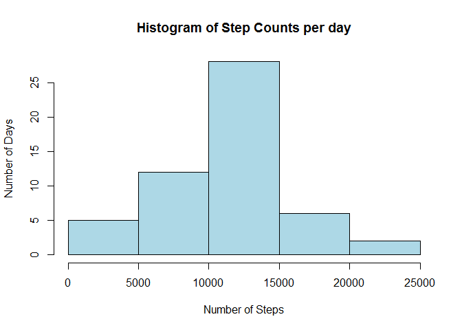
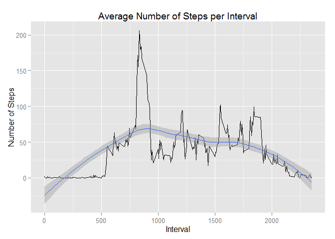
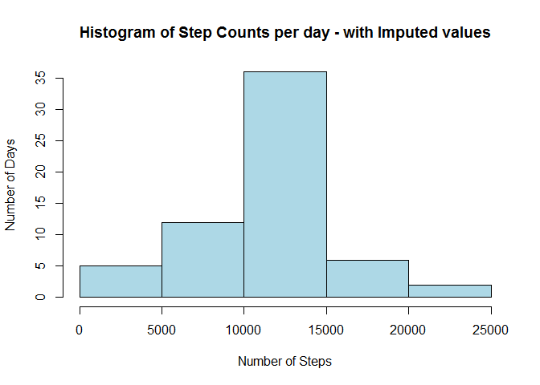
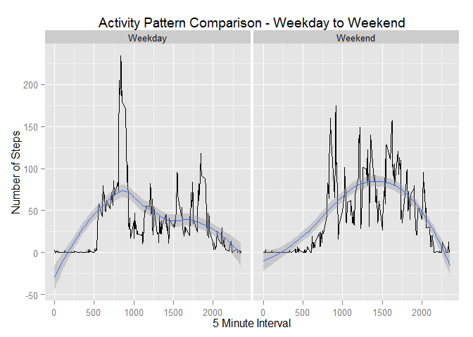

# Reproducible Research: Peer Assessment 1


## Loading and preprocessing the data
Data is in a .CSV file named "activity.csv" within a zip file named "activity.zip"

```r
unzip("activity.zip")
activity <- read.csv("activity.csv")
```

## What is mean total number of steps taken per day?  
A Histogram of the total number of steps per day is as follows, along with the Mean and Median values

```r
TotalStepsPerDay <- aggregate(steps~date,activity,sum)
hist(TotalStepsPerDay$steps, main="Histogram of Step Counts per day",xlab="Number of Steps",ylab="Number of Days", col="lightblue")
```

 

##### Mean number of steps taken per day

```r
mean(TotalStepsPerDay$steps)
```

```
## [1] 10766
```

##### Median number of steps taken per day

```r
median(TotalStepsPerDay$steps)
```

```
## [1] 10765
```

## What is the average daily activity pattern?
Plotting the average number of steps per 5 minute time interval produces the following

```r
AverageStepsPerInterval <- aggregate(steps~interval,activity,mean)
qplot(AverageStepsPerInterval$interval,AverageStepsPerInterval$steps,geom="line",main="Average Number of Steps per Interval",xlab="Interval",ylab="Number of Steps") + geom_smooth(method="loess")
```

 

##### 5 Minute Interval with the maximum number of steps taken

```r
AverageStepsPerInterval[which.max(AverageStepsPerInterval[,2]),1]
```

```
## [1] 835
```

## Imputing missing values
Within the data set there are records with missing values

### Number of Rows with NA Values

```r
colSums(is.na(activity))
```

```
##    steps     date interval 
##     2304        0        0
```

### Impute Logic
The imputing of missing valus is done by taking the average number of steps per interval (calculated above), and for any given interval with NA steps, using this value


```r
activitymerge <- merge(activity,AverageStepsPerInterval,by.x="interval",by.y="interval")
activitymerge[is.na(activitymerge$steps.x),2] <- activitymerge[is.na(activitymerge$steps.x),4]
activityimputed <- activitymerge[,c(2,3,1)]
colnames(activityimputed)[1] <- "steps"
```

### Activity based on Imputed Results
The total number of steps taken per day, after missing values have been imputed using average steps per inteval, shows that while the counts for specific ranges go up, the Mean and Median show only slight deviation.


```r
TotalStepsPerDayImputed <- aggregate(steps~date,activityimputed,sum)
hist(TotalStepsPerDayImputed$steps, main="Histogram of Step Counts per day - with Imputed values",xlab="Number of Steps",ylab="Number of Days", col="lightblue")
```

 

##### Mean number of steps taken per day (Imputed Data)

```r
mean(TotalStepsPerDayImputed$steps)
```

```
## [1] 10766
```

##### Median number of steps taken per day (Imputed Data)

```r
median(TotalStepsPerDayImputed$steps)
```

```
## [1] 10766
```


## Are there differences in activity patterns between weekdays and weekends?
Splitting the data between Weekdays and Weekend days shows a significantly different pattern of activity


```r
activity$dayname <- weekdays(as.Date(activity$date))
WeekdayFactor <- data.frame("Weekday"=c("Monday","Tuesday","Wednesday","Thursday","Friday","Saturday","Sunday"),"Daytype"=c("Weekday","Weekday","Weekday","Weekday","Weekday","Weekend","Weekend"))
activitymerge2 <- merge(activity,WeekdayFactor,by.x="dayname",by.y="Weekday")

weekdaybase <- activitymerge2[activitymerge2$Daytype=="Weekday",]
weekendbase <- activitymerge2[activitymerge2$Daytype=="Weekend",]
weekdayagg <- aggregate(steps~interval,weekdaybase,mean)
weekendagg <- aggregate(steps~interval,weekendbase,mean)
weekdayagg$Daytype <- "Weekday"
weekendagg$Daytype <- "Weekend"
weekfinal <- rbind(weekdayagg,weekendagg)
qplot(interval,steps,data=weekfinal,facets=.~Daytype,geom="line",main="Activity Pattern Comparison - Weekday to Weekend",xlab="5 Minute Interval",ylab="Number of Steps") + geom_smooth(method="loess")
```

 

